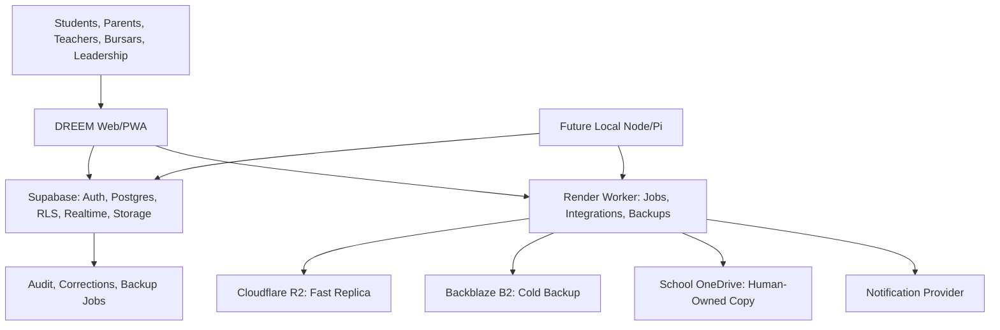

# DREEM Infrastructure Presentation Blueprint

## One-Line Position

DREEM is an education operations kernel for African schools: configurable per institution, resilient across weak connectivity, and strict about finance, identity, audit, and data ownership.

## What To Present

Do not present DREEM as "a school management app with many modules."

Present it as:

- a school operating system
- a data-sovereignty platform
- a configurable institution engine
- an offline-resilient operations layer
- a finance and audit correctness layer
- a future marketplace for country packs, integrations, and implementation partners

## Architecture Story

## The Moat

DREEM becomes defensible when it owns boring but critical school operations:

- correct identity and membership
- school-issued matricules
- role-aware workspaces
- fee invoices, receipts, reversals, and reconciliation
- audit trails for every correction
- offline mutation safety
- parent acknowledgement and notification records
- country-specific reporting packs
- storage sovereignty across Supabase, R2, B2, OneDrive, and local node
- configuration without custom code per school

The moat is not "AI everywhere." The moat is trusted operations plus useful AI after reliable data exists.

## Infrastructure Choices

### Supabase

Used for:

- Auth
- Postgres
- RLS
- Realtime
- Edge Functions
- Storage

Why:

- fastest path to secure school-scoped data
- strong enough for MVP and pilot
- self-hosting remains possible later

Rule:

- DREEM and TSIDKENU may share neutral identity only.
- DREEM business access must flow through `dreem_school_memberships`.

### Render Worker

Used for:

- server-only integrations
- backup jobs
- future notification dispatch
- future OneDrive OAuth callback
- future long-running sync jobs

Why:

- keeps secrets out of frontend and GitHub
- easier to run scheduled jobs than a static frontend

### Cloudflare

Used for:

- Pages frontend deployment
- R2 object backup
- future Turnstile for public admissions/onboarding forms
- future Workers if jobs move closer to the edge

### Backblaze B2

Used for:

- independent cold backup
- protection against relying only on Supabase or Cloudflare

### OneDrive

Used for:

- school-owned administrative copies
- human-readable document backup
- bridge to existing school office habits

## Current Honest State

Built:

- React/Vite PWA shell
- Supabase auth/profile hydration
- DREEM membership boundary
- access provisioning Edge Function
- access suspension/reactivation Edge Function
- operations launch engine
- configurable classes, subjects, fees, languages, modules, terminology
- assignments publish/submit/review flow
- finance records, reversals, reminders, settlements direction
- transport status lane
- communications lane
- backup topology model
- backup job ledger
- R2/B2 snapshot upload adapters
- R2/B2 restore-test endpoints

Not complete:

- OneDrive OAuth and refresh-token storage
- scheduled backup cron
- full double-entry accounting
- full offline IndexedDB sync engine
- real mobile app
- exact Cameroon report-card/government export templates
- production monitoring and incident response
- onboarding wizard with approval history

## Presentation Sequence

1. The real school problem: weak connectivity, fragmented records, payment confusion, parent communication gaps.
2. DREEM thesis: one configurable operations kernel per school.
3. Show the role workspaces.
4. Show finance, reversals, and audit.
5. Show classroom continuity for home-learning situations.
6. Show storage sovereignty and backup topology.
7. Show school launch engine/configuration.
8. Explain rollout: one Cameroon bilingual K-12 pilot, then country pack, then expansion.
9. Explain moat: correctness, resilience, configurability, local fit.
10. Ask for pilot feedback, not generic praise.

## Next Engineering Moves

1. Deploy worker to Render and set only server-side env secrets there.
2. Trigger one R2 backup job and verify a `completed` `backup_jobs` row.
3. Trigger R2 restore-test using the returned `objectKey`.
4. Repeat for B2.
5. Build OneDrive OAuth callback.
6. Add scheduled backup automation.
7. Split frontend modules to remove the 500 kB bundle warning.
8. Turn launch engine into persisted onboarding wizard.
